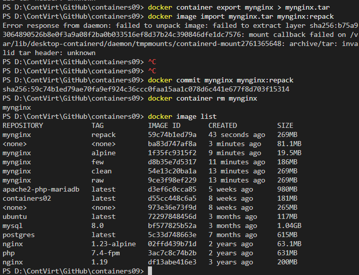

# Lucrarea de laborator numărul 9  
### *Tema:* Optimizarea imaginilor Docker  
### *Data:* 26.04.2025  

## I. Scopul lucrării  
Scopul lucrării este de a se familiariza cu metodele de optimizare a imaginilor Docker, inclusiv:  
- Ștergerea fișierelor temporare și a dependențelor neutilizate  
- Reducerea numărului de straturi  
- Utilizarea unei imagini de bază minime  
- Reambalarea imaginii  
- Combinarea tuturor metodelor  

## II. Sarcina  
Compararea dimensiunilor imaginilor Docker obținute prin diferite metode de optimizare.  

## III. Pregătire  
Pentru această lucrare, am creat un repository `containers09` pe GitHub și l-am clonat pe computer. În directorul `containers09`, am creat un director `site` și am adăugat fișierele necesare pentru un site web.  

## IV. Execuție  

### 1. Imaginea de bază 
Am creat un fișier `Dockerfile.raw` cu următorul conținut:  
```dockerfile
FROM ubuntu:latest  
RUN apt-get update && apt-get upgrade -y  
RUN apt-get install -y nginx  
COPY site /var/www/html  
EXPOSE 80  
CMD ["nginx", "-g", "daemon off;"]  
```
Am construit imaginea cu numele `mynginx:raw` prin comanda:
```sh
docker image build -t mynginx:raw -f Dockerfile.raw .
```


### 2. Eliminarea dependențelor neutilizate și a fișierelor temporare
Creez fisierul `Dockerfile.clean` pentru a elimina fisierele temporare si dependentele neutilizate: 
```dockerfile
# create from ubuntu image
FROM ubuntu:latest

# update system
RUN apt-get update && apt-get upgrade -y

# install nginx
RUN apt-get install -y nginx

# remove apt cache
RUN apt-get clean && rm -rf /var/lib/apt/lists/* /tmp/* /var/tmp/*

# copy site
COPY site /var/www/html

# expose port 80
EXPOSE 80

# run nginx
CMD ["nginx", "-g", "daemon off;"]
```

Ansamblez imaginea cu numele `mynginx:clean`:
```sh
docker image build -t mynginx:clean -f Dockerfile.clean .
```
 

Analizand lista de imagini am calculat dimensiunea a fiind de `4954 MB`.

### 3. Minimizarea numărului de straturi
Minimizez numărul de straturi în `Dockerfile.few`:
```dockerfile
Minimizați numărul de straturi în Dockerfile.few:

# create from ubuntu image
FROM ubuntu:latest

# update system
RUN apt-get update && apt-get upgrade -y && \
    apt-get install -y nginx && \
    apt-get clean && rm -rf /var/lib/apt/lists/* /tmp/* /var/tmp/*

# copy site
COPY site /var/www/html

# expose port 80
EXPOSE 80

# run nginx
CMD ["nginx", "-g", "daemon off;"]
```

Ansamblez imaginea cu numele `mynginx:few`:
```sh
docker image build -t mynginx:few -f Dockerfile.few .
```
 

Analizand lista de imagini am calculat dimensiunea a fiind de `4780 MB`.

### 4. Utilizarea unei imagini de bază minime
Înlocuiesc imaginea de bază cu `alpine` în `Dockerfile.alpine`:
```dockerfile
# create from alpine image
FROM alpine:latest

# update system
RUN apk update && apk upgrade

# install nginx
RUN apk add nginx

# copy site
COPY site /var/www/html

# expose port 80
EXPOSE 80

# run nginx
CMD ["nginx", "-g", "daemon off;"]
```

Ansamblez imaginea cu numele `mynginx:alpine`:
```sh
docker image build -t mynginx:alpine -f Dockerfile.alpine .
```
 

Analizand lista de imagini am calculat dimensiunea a fiind de `4799 MB`.

### 5. Repachetarea imaginii
Repachetez imaginea `mynginx:raw` în `mynginx:repack`:
 


### 6. Utilizarea tuturor metodelor
Creez imaginea `mynginx:minx` utilizând toate metodele de optimizare. Pentru aceasta definesc următorul `Dockerfile.min`:
```dockerfile
# create from alpine image
FROM alpine:latest

# update system, install nginx and clean
RUN apk update && apk upgrade && \
    apk add nginx && \
    rm -rf /var/cache/apk/*

# copy site
COPY site /var/www/html

# expose port 80
EXPOSE 80

# run nginx
CMD ["nginx", "-g", "daemon off;"]
```

Construiesc imaginea cu numele `mynginx:minx` și verific dimensiunea. Repachetez imaginea `mynginx:minx` în `mynginx:min`:
```sh
docker image build -t mynginx:minx -f Dockerfile.min .
docker container create --name mynginx mynginx:minx
docker container export mynginx | docker image import - myngin:min
docker container rm mynginx
docker image list
```
 


   

Verific dimensiunea imaginilor. Aceatsa este de `5183 MB`

### Răspunsuri la întrebări:
1. Cea mai eficientă metodă este utilizarea unei imagini de bază minime (Alpine), combinată cu celelalte tehnici 
2. Fiecare instrucțiune RUN creează un strat nou. Când ștergi fișiere într-un strat nou, acestea sunt doar ascunse, nu eliminate din stratul anterior. Fișierele ocupă spațiu în stratul anterior. Curățarea trebuie făcută în aceeași instrucțiune RUN cu instalarea pentru a reduce spațiul mai efectiv.
3. Repachetarea ia sistemul de fișiere final al unui container și îl transformă într-o nouă imagine cu un singur strat, turitnd toate straturile originale. Poate reduce dimensiunea prin eliminarea fișierelor intermediare și simplifică structura, dar pierde istoria straturilor.

### Concluzii
Lucrarea a explorat optimizarea imaginilor Docker. Am comparat diverse metode și am observat că utilizarea unei imagini de bază minime (Alpine), combinată cu reducerea numărului de straturi și curățarea eficientă a fișierelor temporare (făcută în același pas cu instalarea), oferă cea mai semnificativă reducere a dimensiunii imaginii. Repachetarea poate reduce suplimentar dimensiunea prin aplatizarea (turtirea) straturilor.
